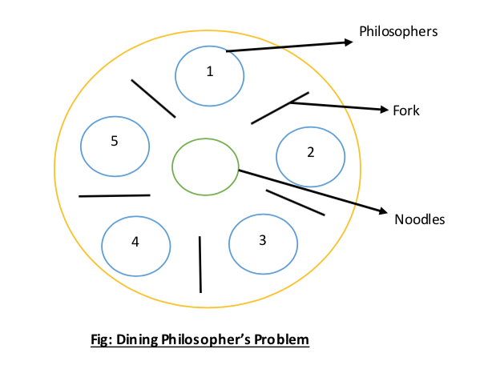

# Dining Philosophers Problem 
In computer science, the dining philosophers problem is an example problem <br>
often used in concurrent algorithm design to illustrate synchronization issues <br>
and techniques for resolving them. [Wikipedia](https://en.wikipedia.org/wiki/Dining_philosophers_problem)

<!--  -->



## Problem/Solution Description

The problem is to implement a solution for the dining philosophers problem using threads,<br>
with semaphores or mutex locks. I used the latter.<br>
The solution should be able to handle any number of philosophers between 1 and 200.


## Usage

```bash
$ make
$ ./philosophers 10 150 60 60 10 #last arg is optional
# <number_of_philosophers> <time_to_die> <time_to_eat> <time_to_sleep/think> [max_eat_count]
```
